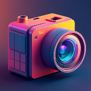

# oklab camera

Inspect the brightness and contrast design of your visual content with this webcam app by visualizing the Oklab color space.

Deploy at: https://oklab-camera.surge.sh

## About Oklab color space

Oklab color consists of three components:

"L" is luminosity,
"a" runs from green to red,
"b" runs from blue to yellow

Learn more about oklab from [Björn Ottosson, A perceptual color space for image processing](https://bottosson.github.io/posts/oklab/)

## License

This project is licensed with [BSD-2-Clause](./LICENSE)

This is free, libre, and open-source software. It comes down to four essential freedoms [[ref]](https://seirdy.one/2021/01/27/whatsapp-and-the-domestication-of-users.html#fnref:2):

- The freedom to run the program as you wish, for any purpose
- The freedom to study how the program works, and change it so it does your computing as you wish
- The freedom to redistribute copies so you can help others
- The freedom to distribute copies of your modified versions to others
